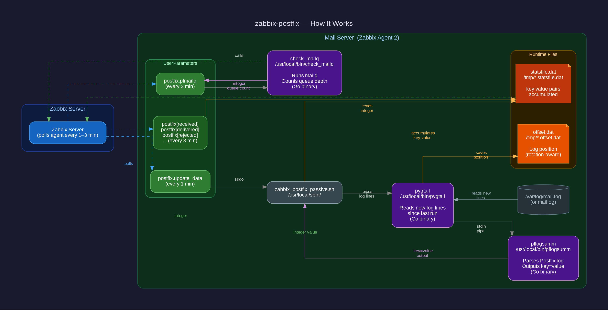

# zabbix-postfix

Postfix monitoring for Zabbix using Go binaries — no Python, no Perl required on the agent host.

See **[HOWTO.md](./HOWTO.md)** for the complete installation and configuration guide.

## Components

| Module | Purpose |
|--------|---------|
| [`pygtail`](./pygtail/) | Incremental log reader — replaces `pygtail.py` |
| [`pflogsumm`](./pflogsumm/) | Postfix log parser — replaces Perl pflogsumm |
| [`check_mailq`](./check_mailq/) | Queue depth counter — replaces `mailq \| grep` pipeline |

Deploy files (copy to the Zabbix agent host):

| File | Destination |
|------|-------------|
| `zabbix_postfix_passive.sh` | `/usr/local/sbin/` |
| `zabbix_postfix_passive.conf` | `/etc/zabbix/zabbix_agent2.d/` |
| `zabbix_postfix_passive` | `/etc/sudoers.d/` |

Import into Zabbix Server:

| File | Purpose |
|------|---------|
| `template_postfix_passive.xml` | Zabbix 6.0 template (14 items, 4 graphs, 4 triggers) |

## Quick Start

```bash
# Build Go binaries (output in dist/ per module, compressed with UPX)
make build

# Run unit tests
make test

# Install binaries to /usr/local/bin/
sudo make install

# Run full installer (copies script, conf, sudoers; restarts agent)
sudo bash install_postfix_template_zabbix_passive.sh
```

## Module Details

- **[pygtail](./pygtail/README.md)** — offset file format identical to `pygtail.py` v0.11.1; supports log rotation and `.gz` files
- **[pflogsumm](./pflogsumm/README.md)** — full Perl-compatible human report (default) or `key=value` Zabbix output (`--zabbix`); `-d today|yesterday`, `--mailq`, and all Perl compat flags supported
- **[check_mailq](./check_mailq/README.md)** — raw integer output; matches `mailq | grep -v "Mail queue is empty" | grep -c '^[0-9A-Z]'`

## Docker Validation

```bash
make build
docker build -f Dockerfile.test-passive -t zabbix-postfix-test .
docker run --rm zabbix-postfix-test
# Expected: Results: 19 passed, 0 failed
```

## Architecture



The Zabbix server polls three UserParameters on the agent every 1–3 minutes. `postfix.update_data` runs the `pygtail → pflogsumm` pipeline and accumulates metrics into a stats file. `postfix[*]` reads a single integer from that file. `postfix.pfmailq` calls `check_mailq` directly for a live queue count.

See [HOWTO.md](./HOWTO.md) for the full installation guide.

## Roadmap

| Step | Status |
|------|--------|
| Go binaries | ✓ done — golden test matches Perl pflogsumm exactly |
| Zabbix wiring | ✓ done — validated via Docker (19/19) |
| Native Zabbix plugin | planned — `check_postfix` importing `pflogsumm/pkg/parser` |
