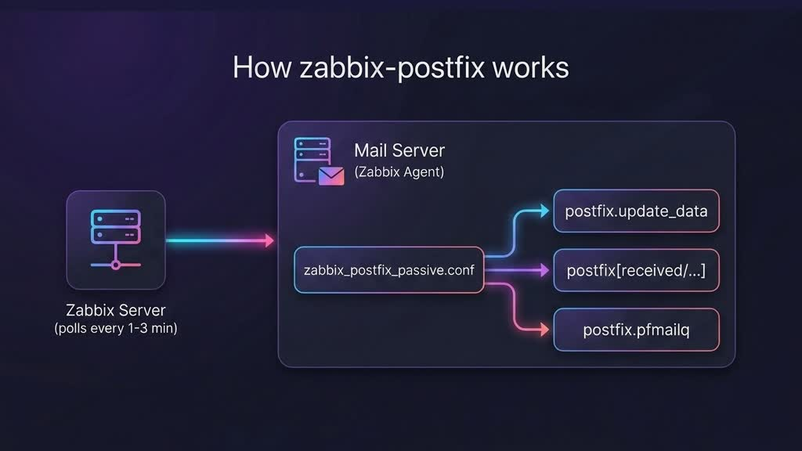
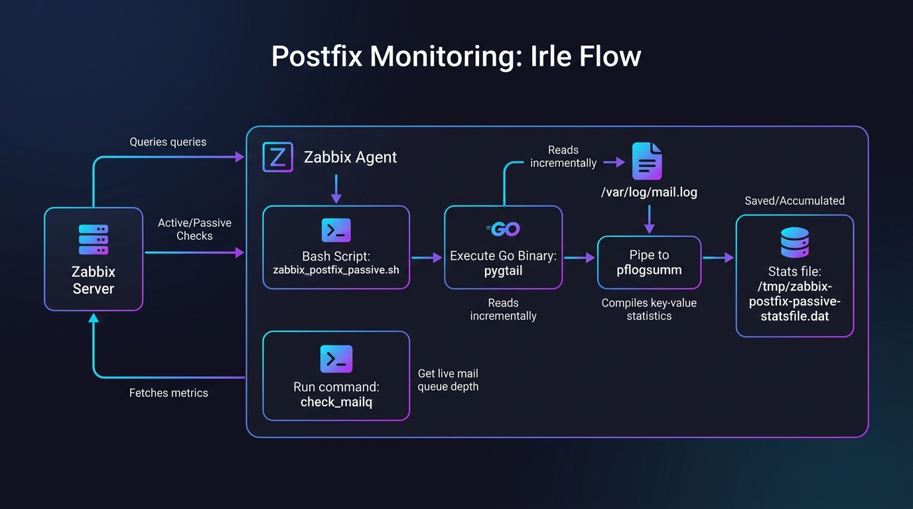
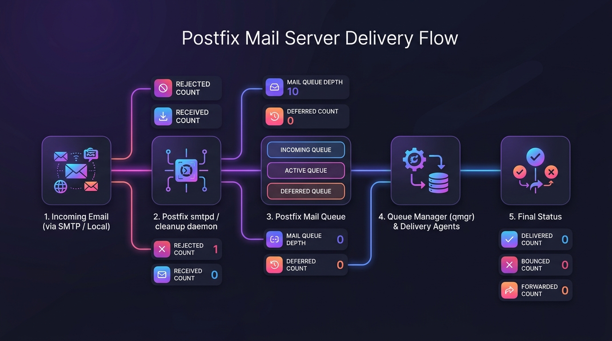
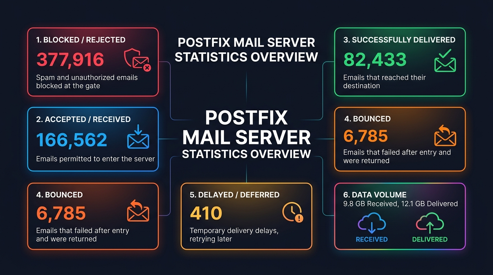
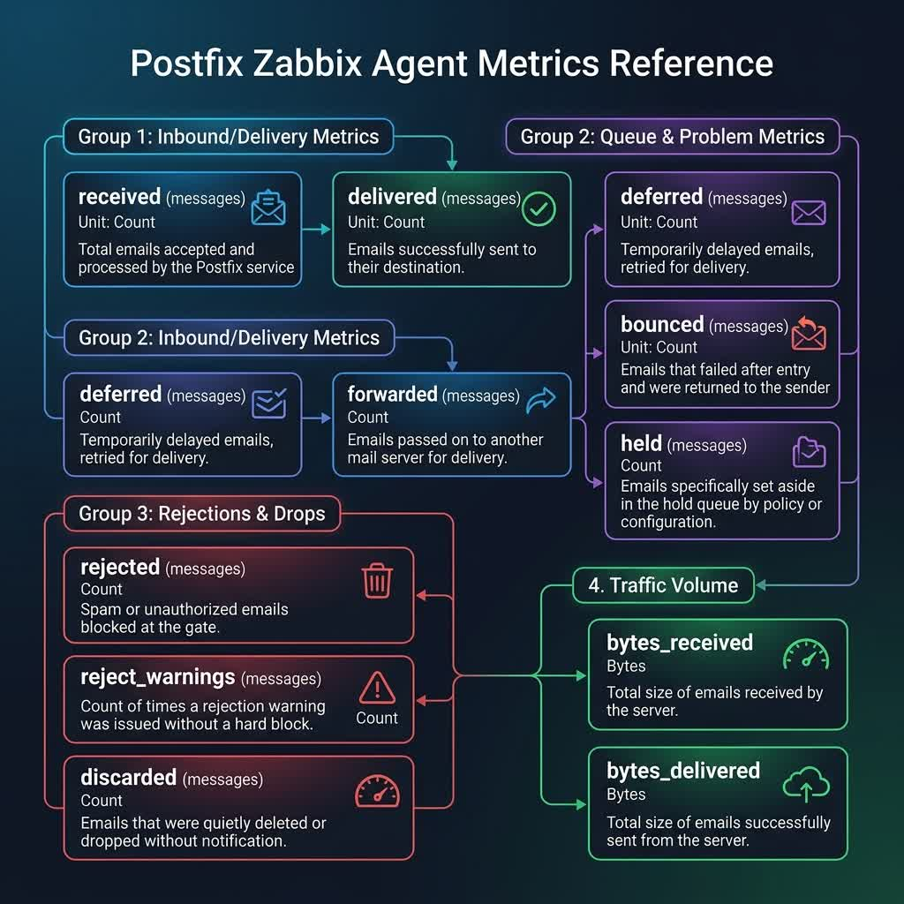

# Screenshots and Diagrams

This directory contains the architecture and data flow diagrams for the `zabbix-postfix` integration.

---

## 1. General Operation (Macro View)

Macro view diagram showing how the Zabbix Server periodically interacts with the Zabbix Agent on the mail server.

---

## 2. Zabbix-Postfix Integration Flow

Detailed diagram showing the interaction between the Zabbix Server/Agent, the helper Bash script, and the Go binaries (`pygtail` and `pflogsumm`) to incrementally read and accumulate log statistics.

---

## 3. Postfix Mail Server Delivery Flow

Internal email delivery flow in Postfix mapped against the respective metrics captured and sent to Zabbix (Received, Delivered, Rejected, Deferred, Queue Depth).

---

## 4. Postfix Mail Server Statistics Overview (For Beginners)

A visual dashboard summarizing sample Postfix traffic stats (delivered, blocked, deferred, bounced, and volume) with friendly, non-technical explanations of each term.

---

## 5. Postfix Zabbix Agent Metrics Reference

A comprehensive visual reference diagram showing all 11 Postfix metrics captured by the agent, grouped logically (Inbound/Delivery, Queue & Problem, Rejections & Drops, and Traffic Volume) with their keys, units, and descriptions.

