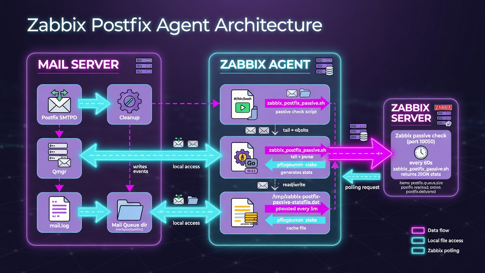
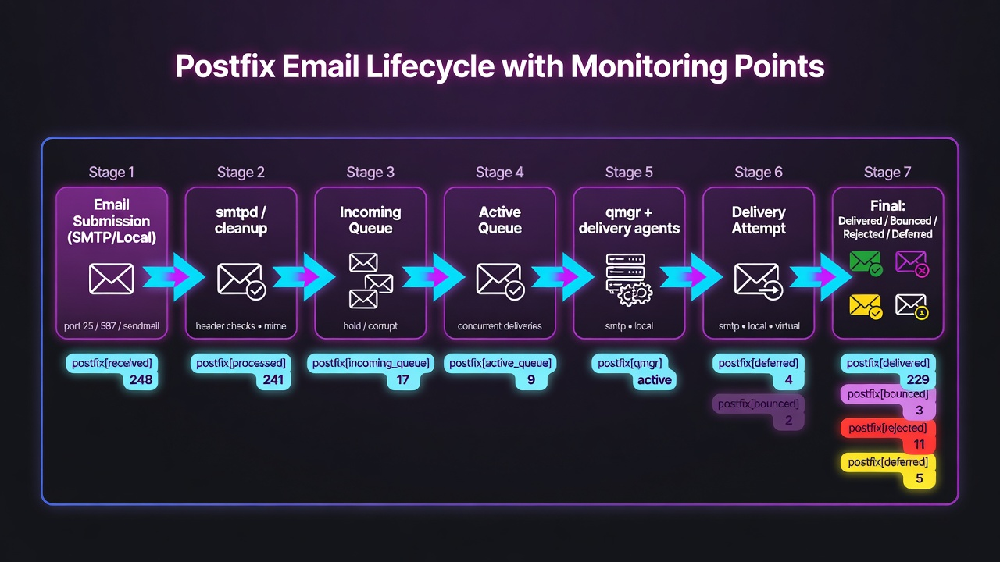
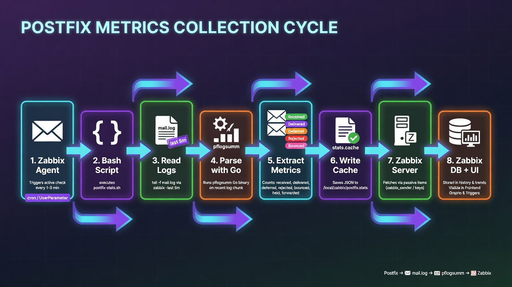
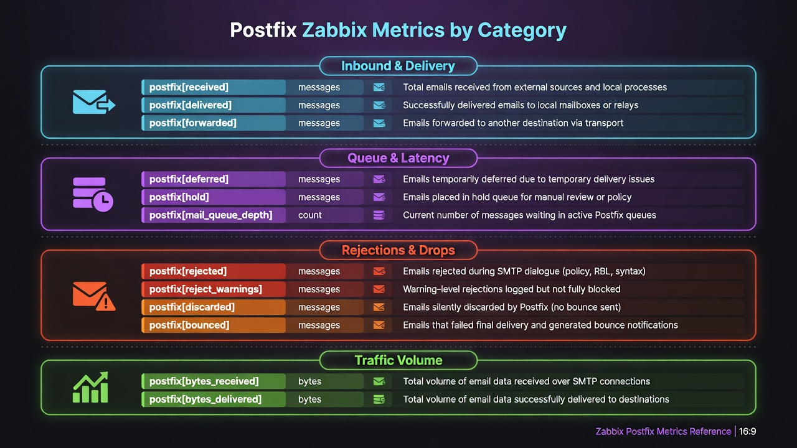
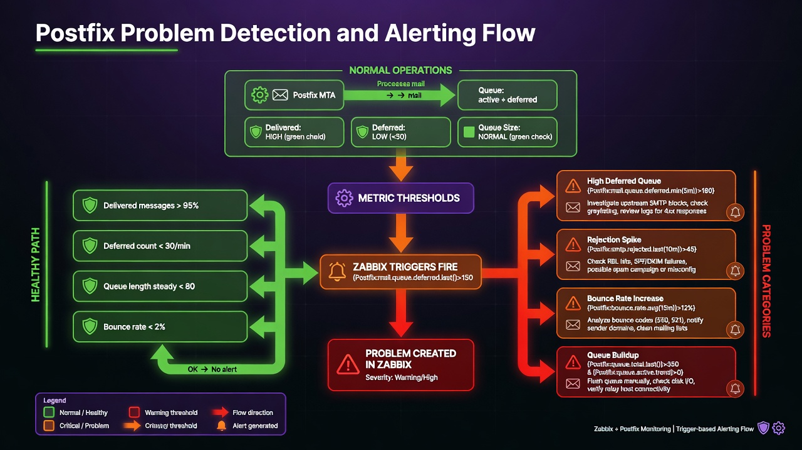

# Screenshots and Diagrams

This directory contains the architecture and data flow diagrams for the `zabbix-postfix` integration.

---

## 1. Zabbix Postfix Agent Architecture

Detailed component diagram showing the main pieces involved in monitoring: the Postfix processes and files on the mail server (smtpd, cleanup, qmgr, mail.log, queue directory), the Zabbix Agent layer (bash wrapper script, pflogsumm Go binary and the local stats cache file), and the Zabbix Server performing passive checks.

---

## 2. Postfix Email Lifecycle with Monitoring Points

Wide 16:9 diagram illustrating the complete journey of an email through Postfix (7 stages from submission to final status) and highlighting exactly which metrics (`postfix[received]`, `postfix[deferred]`, `postfix[delivered]`, etc.) are captured at each step.

---

## 3. Postfix Metrics Collection Cycle

End-to-end pipeline that explains how raw Postfix log data becomes Zabbix metrics: from the agent trigger, through incremental log reading, pflogsumm parsing, stats extraction, local cache file, Zabbix server fetch, and finally storage in the database and UI.

---

## 4. Postfix Zabbix Metrics by Category

Clean reference chart that groups all captured Postfix metrics into four logical categories:

- Inbound & Delivery
- Queue & Latency
- Rejections & Drops
- Traffic Volume

Each metric shows its key name, unit and description.

---

## 5. Postfix Problem Detection and Alerting Flow

Flowchart that contrasts the healthy operations path with common problem scenarios. It shows how metric thresholds cause Zabbix triggers to fire, create Problems, and lists practical remediation actions for high deferred queue, rejection spikes, bounces, and queue buildup.

